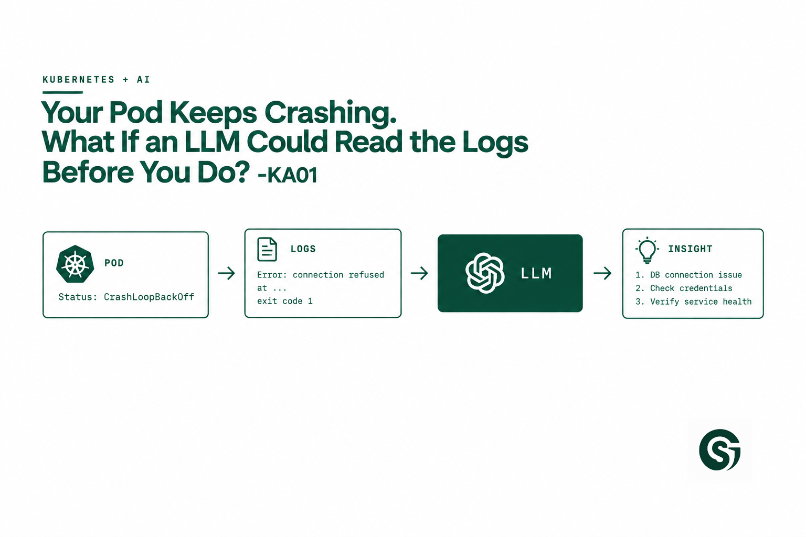

# KA01 — Kubernetes AI Assistant

Give an LLM controlled, read-only access to `kubectl` output and let it
correlate pod status, events and logs into ranked troubleshooting
hypotheses — evidence and interpretation kept clearly separate.

<a href="https://techworldwithsahana.substack.com/p/llm-kubernetes-debugger-crashloopbackoff">
  
</a>

Understand the concepts behind this build: *Your Pod Keeps Crashing. What If an LLM Could Read the Logs Before You Do?*



## What this is

A CLI tool. You give it a pod, it gives you a structured investigation.

```
$ python -m src.cli investigate checkout-api-7d9f8b6c5-xk2mz -n payments
```

- **Input:** pod name + namespace
- **Processing (deterministic):** three read-only Kubernetes API calls,
  field extraction, log truncation, secret redaction
- **AI (one call):** ranked hypotheses with cited evidence, returned as
  validated JSON
- **Output:** a report that visually separates observed facts from
  model interpretation

No agent. No tool calling. No RAG. No writes to the cluster.

## Project layout

```
KA01-kubernetes-ai-assistant/
├── src/
│   ├── collector.py    # Kubernetes API calls (read-only)
│   ├── context.py      # field extraction, redaction, truncation
│   ├── redactor.py     # regex secret/PII redaction (logs + events)
│   ├── analyzer.py     # LLM call, schema validation
│   ├── grounding.py    # evidence-citation check (anti-hallucination)
│   └── cli.py           # entry point
├── tests/               # pytest, no cluster or API key needed
├── examples/            # saved evidence bundles for offline testing
│   ├── oomkilled.json
│   ├── imagepullbackoff.json
│   └── probe-failure.json
├── requirements.txt
└── .env.example
```

## Setup

```bash
python -m venv .venv
source .venv/bin/activate
pip install -r requirements.txt   # add -r requirements-dev.txt to run tests
cp .env.example .env   # fill in ANTHROPIC_API_KEY
```

Requires a valid kubeconfig context pointing at the cluster you want to
investigate (`kubectl config current-context` to check).

## Usage

```bash
python -m src.cli investigate <pod-name> -n <namespace>

# also save the evidence bundle to disk
python -m src.cli investigate <pod-name> -n <namespace> --save-evidence ./evidence.json

# inside the cluster (uses in-cluster ServiceAccount instead of local kubeconfig)
python -m src.cli investigate <pod-name> -n <namespace> --in-cluster
```

## Testing without a live cluster

The `examples/` folder contains saved evidence bundles from three real
failure modes (OOMKilled, ImagePullBackOff, failed liveness probe).
Use these to iterate on the prompt in `analyzer.py` without needing a
cluster or burning API calls against live data:

```python
import json
from src.analyzer import call_llm, verify_evidence_grounding

evidence = json.load(open("examples/oomkilled.json"))
analysis = call_llm(evidence)
analysis = verify_evidence_grounding(analysis, evidence)
print(analysis.summary)
```

## Running the tests

```bash
pip install -r requirements-dev.txt
pytest
```

The tests build real `kubernetes` client objects and fake the model, so
they need neither a cluster nor an API key.

## Required RBAC (in-cluster deployment)

This tool should never run with more access than it needs:

```yaml
apiVersion: rbac.authorization.k8s.io/v1
kind: ClusterRole
metadata:
  name: k8s-assist-reader
rules:
  - apiGroups: [""]
    resources: ["pods", "events"]
    verbs: ["get", "list", "watch"]
  - apiGroups: [""]
    resources: ["pods/log"]
    verbs: ["get"]
```

No `create`, `update`, `patch` or `delete` — by construction, not by
prompt instruction.

## Known limitations

- Single-pod, single-container scope. For multi-container pods the tool
  picks the container that has crashed / is waiting / restarted most
  (so a crash-looping sidecar is found), but it does not correlate
  across containers. Doesn't (yet) look at Deployment/ReplicaSet
  history or sibling pods.
- No caching — repeated investigations of the same pod re-call the
  model. See "How This Could Evolve" in the newsletter for the
  production-hardening path.
- Redaction is regex-based (`redactor.py`): passwords/tokens/secrets in
  `key=value` and JSON form, bearer tokens, JWTs, URL credentials, AWS
  keys, private keys, emails. It is a safety net, not a guarantee —
  extend the patterns for your own naming conventions and review the
  evidence (`--save-evidence`) before pointing this at anything real.
- The grounding check is a heuristic: it catches invented log lines and
  values, not wrong reasoning from real evidence. Unverified citations
  are flagged in the report, never silently dropped.
- Model defaults to `claude-sonnet-4-6`; override with `ANTHROPIC_MODEL`.

---

## ⭐ Support

If you found this repository useful:

<a href="https://github.com/saghosh8/ai-engineering-lab">
  
</a>
<a href="https://github.com/saghosh8/ai-engineering-lab/fork">
  
</a>

---
